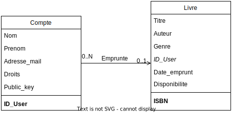

# projet-c-esiea
Database diagram : [Draw.io](https://app.diagrams.net/#Harkonny%2Fprojet-c-esiea%2Fmain%2FDataBase_Diagram.drawio)  

On n'a qu'__UN__ exemplaire de chaque livre
Un livre emprunté ne peut pas être emprunté par quelqu'un d'autre

1. Ajout de livres :
Classe livre :
- titre
- auteur
- ISBN
- genre
- ID_user
- date d'emprunt -> permettra de calculer la date de retour

2. Recherche de livres :
Recherche de livre :
input ->  titles | authors (selection de titre/auteur par user)

3. Emprunt et Retour de Livres :
-> liste des utilisateurs
Classe utilisateur :
- nom
- prénom
- mail
- authentification (mot de passe ? gestion sécurisée des mdp)
- ID_user

-> Fonction d'emprunt, vérifiant la disponibilité du livre sélectionné
-> Fonction de retour, bouton permettant de confirmer avoir retourné un livre
-> Gestion de l'emprunt dans la classe livre

4. Affichage de la Liste des livres disponibles :
-> voir selon l'interface graphique utilisée
(scroller parmis les livres, trier l'affichage, optionellement mettre une couverture aux livres)

5. Affichage des livres empruntés :
-> voir tout les livres empruntés

(implication du 4. et 5.)
-> Livre emprunté|disponible correspond à une option de recherche
-> Informations à propos de l'emprunteur et la date d'emprunt anonyme à moins d'avoir un compte administrateur (gestion des comptes admin ?)
-> compte admin correspond au premier compte créé par la bibliothèque, voir les droits de gestions de comptes etc...

6. Sauvegarde des données :
Utilisation d'une bibliothèque de gestion de base de donnée SQL
-> permet d'en utiliser la fonction de recherche notamment, plutôt que l'implémenter nous-même
/!\ -> doit pouvoir être portable avec l'exécutable /!\

7. Interface Utilisateur
-> trouver bibliothèque de gestion graphique pour afficher des listes, faire des recherches.

## BONUS
1. Gestion des utilisateurs :
(création de compte, connexion et déconnexion)
Page de connexion avant recherche
-> compte invité, sans mot de passe pour tout de même faire une recherche
(pas de possibilité d'emprunt ou d'historique des livres empruntés)

Page listant les livres empruntés par le user (sur le côté)

2. Recherche avancée :
ajout de année de publication, mots-clé (recherche parmi tout les paramètres de la classe livre), disponibilité

3. Statistiques de la Bibliothèque :
Compte du nombre de fois qu'un livre a été emprunté dans la classe livre
-> permet de calculer les auteurs les plus popoulaires
Nbr de livres empruntés = somme des livres dans la liste "empruntés"
Nbr total de livres = somme de la liste des livres

4. Date de Retour :
- Calculée à partir de la date d'emprunt + la durée de l'emprunt
(Durée fixe)

date auj. - durée d'emprunt = date d'emprunt à notifier

Plusieurs états de notification :
- état good, rien à déclarer
- état attention, date de retour proche (aux trois-quarts de la durée d'emprunt ?)
- état aujourd'hui, date de retour maintenant
- état en retard, date de retour dépassée
